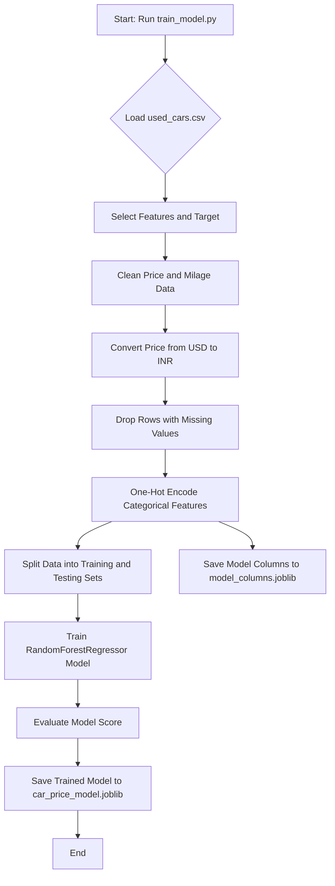

# Advanced Car Price Predictor 🚗

This project is a web application built with Streamlit that uses a machine learning model to predict the price of used cars. It provides users with not just a price estimate but also valuable market insights to help them make informed decisions.

-----

## Features

  * **📈 Accurate Price Prediction:** Uses a `RandomForestRegressor` model to predict car prices based on features like brand, model year, mileage, and more.
  * **📊 Market Analysis:** Displays a price distribution plot for similar cars, showing users where their predicted price stands in the current market.
  * **🔥 "Good Deal" Identifier:** Analyzes similar car listings from the dataset and flags those that are priced significantly below their predicted market value.
  * **🧠 Explainable AI:** Shows a feature importance chart, revealing which factors (e.g., mileage, model year) have the biggest impact on the price.
  * **📋 Multi-Car Comparison:** Allows users to save multiple predictions to a comparison list for easy side-by-side analysis.
  * **🌍 Currency Conversion:** Correctly converts prices from the original USD dataset to INR for local relevance.

-----

## Technology Stack

  * **Backend:** Python
  * **Machine Learning:** Scikit-learn, Pandas, NumPy
  * **Web Framework:** Streamlit
  * **Plotting:** Matplotlib, Seaborn

-----

## Setup and Installation

Follow these steps to run the project on your local machine.

### **1. Prerequisites**

  * Python 3.8 or higher installed.
  * `pip` (Python package installer).

### **2. Clone the Repository (or Download Files)**

If you are using Git, clone the repository. Otherwise, just make sure all the project files (`app.py`, `train_model.py`, `used_cars.csv`) are in the same folder.

```bash
git clone https://github.com/Vishnudevverse/ML
cd ML
```

### **3. Train the Machine Learning Model**

Before you can run the app, you need to train the model. This will create the `.joblib` files.

```bash
python train_model.py
```

### **4. Run the Streamlit App**

Now, you're ready to launch the web application\!

```bash
streamlit run app.py
```

A new tab should open in your web browser with the running application.

-----

## Usage

1.  Use the controls in the **sidebar** on the left to enter the details of a car.
2.  Click the **"Predict Price"** button.
3.  View the predicted price, market analysis, and similar car listings on the main page.
4.  Click **"Add to Comparison"** to save a car's details to the comparison table at the bottom of the page.

-----

## Program Control Flow

The project is divided into two main Python scripts: `train_model.py` for creating the machine learning model, and `app.py` for serving the user-facing web application.

### 1. Model Training (`train_model.py`)

This script is responsible for preparing the data and training the `RandomForestRegressor` model. The workflow is as follows:

1.  **Load Data**: The script begins by loading the `used_cars.csv` dataset using Pandas.
2.  **Feature Selection**: It selects a specific subset of columns (e.g., `model_year`, `milage`, `fuel_type`) that will be used as features for the model, with `price` as the target variable.
3.  **Data Cleaning**:
    *   The `price` and `milage` columns, which are initially strings (e.g., "$25,000", "50,000 mi."), are cleaned by removing non-numeric characters.
    *   These columns are then converted to numeric data types.
    *   The script handles missing values by dropping any rows that contain them (`dropna()`).
4.  **Currency Conversion**: The `price` column, originally in USD, is converted to INR by multiplying by a fixed conversion rate.
5.  **Encoding Categorical Features**: The script uses `pd.get_dummies()` to perform one-hot encoding on categorical features like `fuel_type`, `brand`, and `transmission`. This converts them into a numerical format that the model can understand.
6.  **Save Model Columns**: After encoding, the script saves the list of resulting column names to a file named `model_columns.joblib`. This is crucial for ensuring that the input from the web app has the exact same structure as the data the model was trained on.
7.  **Train-Test Split**: The cleaned dataset is split into training (80%) and testing (20%) sets.
8.  **Model Training**: A `RandomForestRegressor` model is instantiated and trained on the training data (`X_train`, `y_train`).
9.  **Save Trained Model**: The fully trained model is serialized and saved to a file named `car_price_model.joblib`, making it ready for use in the application.



### 2. Web Application (`app.py`)

This script uses Streamlit to create an interactive web interface that allows users to get predictions from the trained model.

1.  **Load Assets**: When the app starts, it loads the trained model (`car_price_model.joblib`), the model columns (`model_columns.joblib`), and the `used_cars.csv` dataset. These assets are cached for efficiency.
2.  **User Interface**:
    *   A title and a sidebar are displayed.
    *   The sidebar contains input widgets (sliders and select boxes) for the user to enter car details like model year, mileage, brand, etc. The options for the dropdowns are populated from the loaded dataset.
3.  **Prediction Workflow**:
    *   The user fills in the details and clicks the **"Predict Price"** button.
    *   The script captures these inputs and places them into a Pandas DataFrame.
    *   This input DataFrame is then one-hot encoded using `pd.get_dummies()`.
    *   A critical step follows: the encoded input's columns are **aligned** with the columns saved in `model_columns.joblib`. The `.reindex()` method ensures that the input DataFrame has the exact same columns in the same order as the data used to train the model, filling any missing columns with `0`.
    *   The aligned DataFrame is passed to the `model.predict()` method to get the price prediction.
4.  **Displaying Results**:
    *   The predicted price is displayed prominently.
    *   The application generates and displays several data visualizations to give the user market context:
        *   **Feature Importance**: A bar chart shows which features had the most influence on the model's prediction.
        *   **Price Distribution**: A histogram shows the range of prices for similar cars (same brand and model year) from the dataset, with a vertical line indicating the user's predicted price.
        *   **Similar Listings**: A table displays real listings from the dataset that are similar in brand, year, and price. It also includes a "Deal Status" column that flags listings priced well below their predicted value.
5.  **Comparison Feature**: The app maintains a "comparison list" in the session state. Users can add their prediction results to this list, which is displayed in a table at the bottom of the page, allowing for side-by-side comparison of multiple cars.

This structured flow ensures that the model is trained correctly and that the user's input is processed in a way that is perfectly compatible with the trained model, leading to accurate and reliable predictions.

```mermaid
graph TD
    subgraph "User Interaction"
        A[Open Web App] --> B{Use Sidebar to Input Car Details};
        B --> C{Click 'Predict Price' Button};
    end

    subgraph "Backend Processing"
        D[Start: Run streamlit run app.py] --> E[Load Model, Columns, and Dataset];
        E --> A;
        C --> F[Create DataFrame from Inputs];
        F --> G[Encode & Align Input Columns];
        G --> H[model.predict(aligned_input)];
    end

    subgraph "Display Results"
        H --> I[Show Predicted Price];
        I --> J[Display Feature Importance Plot];
        J --> K[Display Market Price Distribution];
        K --> L[Display Similar 'Good Deal' Listings];
        L --> M{Add to Comparison?};
        M -- Yes --> N[Append to Comparison List Table];
        M -- No --> O[Ready for New Prediction];
        N --> O;
    end
```

-----

## Dataset

This project uses the "Used Car Price Prediction" dataset, which can be found on Kaggle. The dataset contains information on thousands of used car listings with various features.

*https://www.kaggle.com/datasets/taeefnajib/used-car-price-prediction-dataset?resource=download*